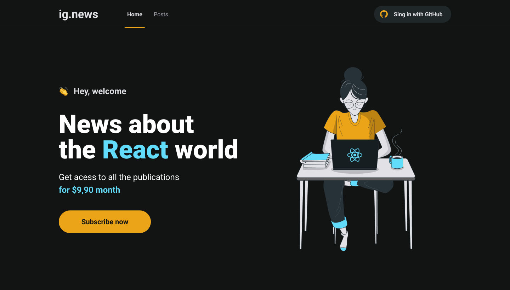
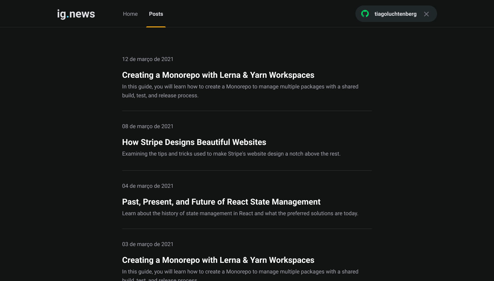

<h1 align="center">
     
</h1>

<p align="center">  
 Ignews é uma aplicação que foi desenvolvida durante o terceiro módulo do Ignite da <a href="https://rocketseat.com.br/">Rocketseat</a>
</p>

<h4 align="center">
	🚧 Concluído 🚀 🚧
</h4>

Tabela de conteúdos
=================
<!--ts-->
   * [Sobre o projeto](#-sobre-o-projeto)
   * [Layout](#-layout)
     * [Web](#web)
   * [Como executar o projeto](#-como-executar-o-projeto)
   * [Tecnologias](#-tecnologias)
   * [Licença](#user-content--licença)
<!--te-->


## 💻 Sobre o projeto

<p>O projeto é um blog onde você tem a possibilidade de fazer login com a conta do Github criando o OAuth nas configurações da conta pessoal para usar com o <a href="https://next-auth.js.org/">NextAuth.js</a> e realizar uma assinatura mensal na plataforma de pagamento <a href="https://stripe.com/br">Stripe</a> para ter acesso total aos posts que são criados atraves da plataforma do <a href="https://prismic.io/">Prismic CMS</a>.</p>
<p>Além disso usamos o <a href="https://fauna.com/">Fauna</a> que é um banco de dados que vai ajudar a identificar quando um usuario já está com o plano ativo ou não. <br> No final da pagina tem o link da documentação de todas tecnologias usadas no projeto.</p>

## 🎨 Layout

### Web

<p align="center" style="display: flex; align-items: flex-start; justify-content: center;">
  
  
    
</p>

<p align="center" style="display: flex; align-items: flex-start; justify-content: center;">
  
</p>

## 🚀 Como executar o projeto

Este projeto pode ser executado apenas com esse repositorio:<br>
Obs: Na raiz do projeto tem um arquivo .env.example onde mostra exatamente o mesmo modelo que uso para executar o projeto usando as chaves através da variavél de ambiente.<br>

Para criar elas basta seguir os passos da documentação das ferramentas que estão comentadas no arquivo no tópico [Tecnologias](#-tecnologias).

### Pré-requisitos

Antes de começar, você vai precisar ter instalado em sua máquina as seguintes ferramentas:
[Git](https://git-scm.com), [Node.js](https://nodejs.org/en/). 
Além disto é bom ter um editor para trabalhar com o código como [VSCode](https://code.visualstudio.com/)

#### Rodando a aplicação web (Frontend)

```bash

# Clone este repositório
$ git clone https://github.com/Tuhh16/ignite-modulo-3-ignews.git

# Acesse a pasta do projeto no seu terminal/cmd
$ cd ignite-modulo-3-ignews

# Instale as dependências
$ yarn install

# Execute a aplicação em modo de desenvolvimento
$ yarn dev

# A aplicação será aberta na porta:3000 - acesse http://localhost:3000

```

---

## 🛠 Tecnologias

As seguintes ferramentas foram usadas na construção do projeto:

-   **[TypeScript](https://www.typescriptlang.org/)**
-   **[ReactJs](https://pt-br.reactjs.org/)**
-   **[NextJs](https://nextjs.org/docs/getting-started)**
-   **[GitHub](https://docs.github.com/pt)**
-   **[NextAuth.js](https://next-auth.js.org/getting-started/introduction)**
-   **[Fauna](https://docs.fauna.com/fauna/current/start/index.html)**
-   **[Prismic](https://prismic.io/docs)**

> Veja o arquivo  [package.json](https://github.com/Tuhh16/ignite-modulo-3-ignews/blob/master/package.json)

---

## 📝 Licença

Este projeto esta sobe a licença [MIT](./LICENSE).

Feito por Arthur Teodoro Alves de Lima 👋🏽 [Entre em contato!](https://www.linkedin.com/in/arthur-lima-reactjs/)
